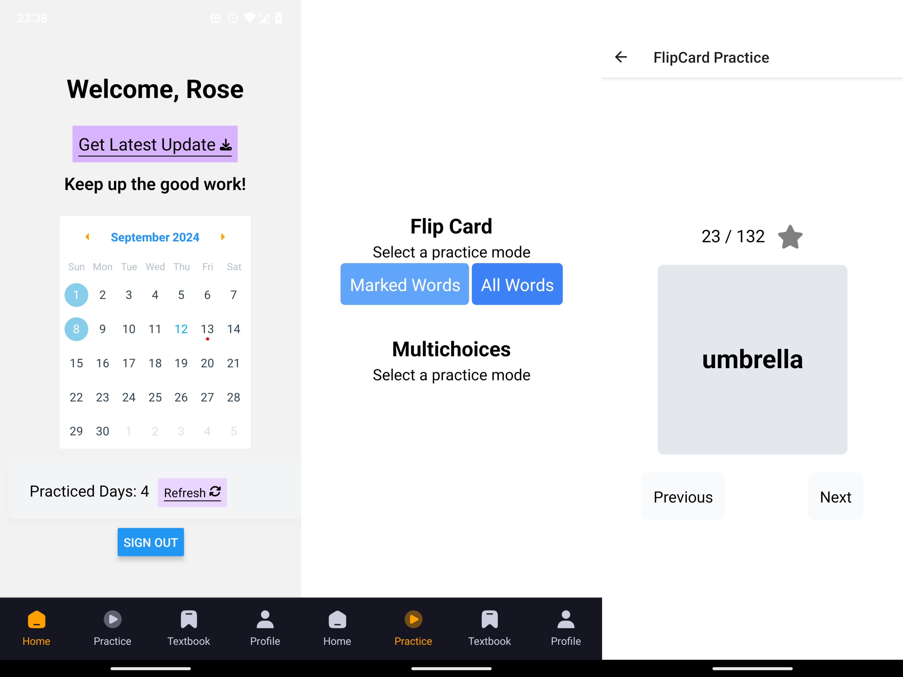
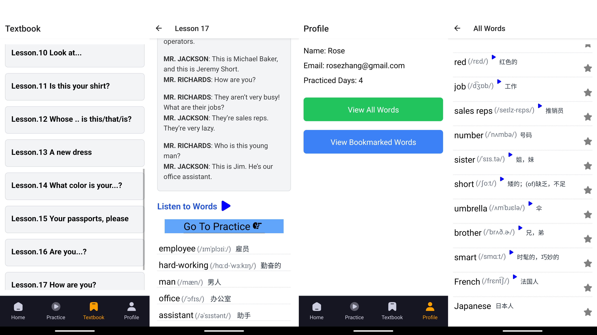

# English Learning App
This is an [Expo](https://expo.dev) project.

This is a mobile application built using **React Native**. The app is designed to help users practice and learn English vocabulary through practices, and also can learn from textbook with audios included. It also provides tracking of practice progress.

## Features

- **Flip Card Practice:** Users can practice with either all words or only their bookmarked words.
- **Home Page:** Tracks user progress, such as practiced days.
- **Profile Page:** Display user related data, such as bookmarked words and created notes(tbd).
- **Textbook Integration:** Lessons stored in a database that can be practiced and bookmarked.
- **Authentication:** User accounts managed via Firebase Authentication.
- **Data Storage:** All user-related data such as words, lessons, and practice progress is stored in Firebase Firestore.

## Screenshots

### Home and Practice Pages

### Textbook and Profile Pages

## Tech Stack

- **React Native:** For building the mobile application.
- **Firebase Authentication:** For user authentication.
- **Firebase Firestore:** For storing user data, lessons, and word practice.
- **Sentry:** Track bugs when users using on different devices and analyze.